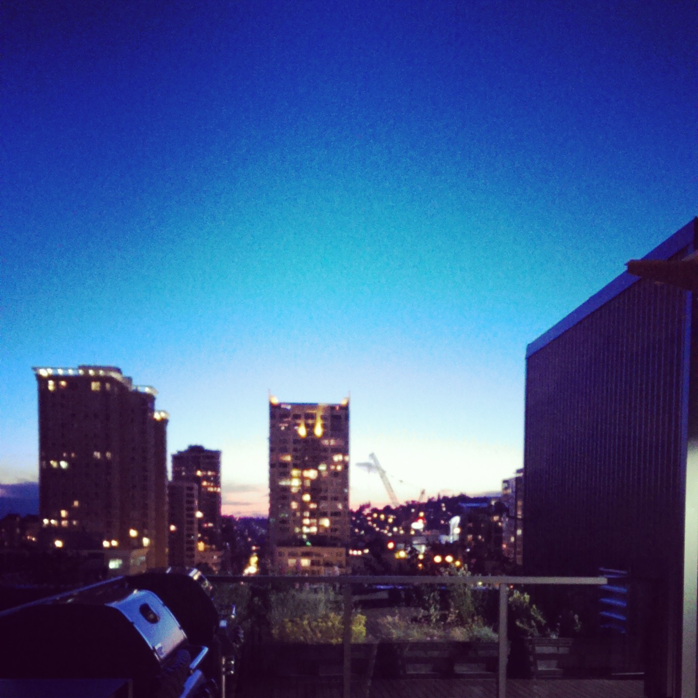

# GitHub Blog
See it [live](https://abstractOwl.github.io)!

Jekyll also automatically publishes an [atom feed](/atom.xml).

## Feedback

If you have any questions/comments, feel free to write a Disqus comment or
open an issue!

## License

The "_posts/" and "_images" directories and their contents are licensed under a
[Creative Commons Attribution-NonCommercial-ShareAlike 4.0 International License]
(http://creativecommons.org/licenses/by-nc-sa/4.0/).

Everything else is licensed under the [BSD license](LICENSE).

 

---

[![Creative Commons License]
(https://i.creativecommons.org/l/by-nc-sa/4.0/88x31.png)]
(http://creativecommons.org/licenses/by-nc-sa/4.0/)

 
